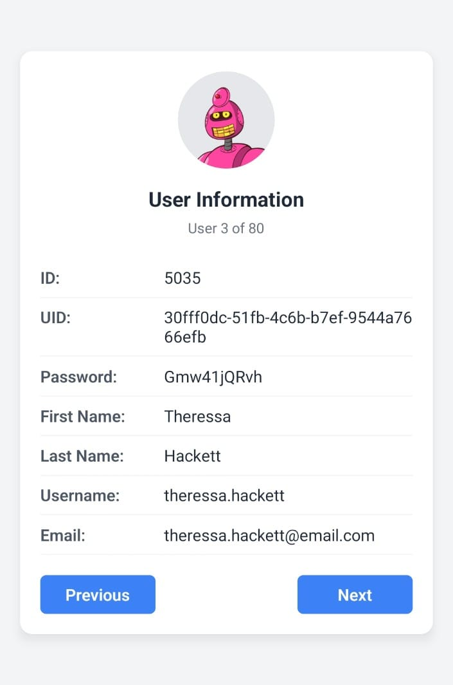

# User Information App 📱

A React Native mobile application built with Expo that fetches and displays user information from a public API. The app allows navigation through multiple user profiles with simple Previous and Next buttons, styled using NativeWind (Tailwind CSS for React Native).



## 🚀 Features

- Display comprehensive user information including:
  - ID
  - UID
  - Password
  - First Name
  - Last Name
  - Username
  - Email
  - Avatar (user image)
- Navigate through user profiles with Previous and Next buttons
- Clean, responsive UI design using NativeWind
- Error handling for API requests
- Loading state feedback

## 🛠️ Tech Stack

- React Native
- Expo
- NativeWind (Tailwind CSS)
- Random Data API

This is an [Expo](https://expo.dev) project created with [`create-expo-app`](https://www.npmjs.com/package/create-expo-app).

## 🏁 Get started

1. Install dependencies
   ```bash
   npm install
   ```

2. Start the app
   ```bash
   npx expo start
   ```

In the output, you'll find options to open the app in a:
- [development build](https://docs.expo.dev/develop/development-builds/introduction/)
- [Android emulator](https://docs.expo.dev/workflow/android-studio-emulator/)
- [iOS simulator](https://docs.expo.dev/workflow/ios-simulator/)
- [Expo Go](https://expo.dev/go), a limited sandbox for trying out app development with Expo

You can start developing by editing the files inside the **app** directory. This project uses [file-based routing](https://docs.expo.dev/router/introduction).

## 🔄 API Usage

The app fetches user data from the Random Data API:
```
https://random-data-api.com/api/users/random_user?size=80
```

The `size` parameter specifies the number of users to fetch (80 in this case).

## 📺 Project Structure

```
UserFetch/
├── App.js             # Main application component
├── assets/            # Images, fonts, and other static assets
├── babel.config.js    # Babel configuration with NativeWind plugin
├── package.json       # Project dependencies
└── tailwind.config.js # Tailwind CSS configuration
```

## 🎯 Implementation Details

### Styling with NativeWind

This project uses NativeWind, which brings Tailwind CSS's utility-first approach to React Native. This provides:
- Clean, maintainable code with utility classes
- Consistent design language across the application
- Faster development with pre-defined styles

### Data Management

- User data is fetched from the Random Data API
- State management is handled with React hooks
- Navigation between user profiles is managed with a simple state-based approach

### Error Handling

The app includes comprehensive error handling for:
- API fetch failures
- Empty data responses
- Network errors

## 🧪 Get a fresh project

When you're ready, run:
```bash
npm run reset-project
```

This command will move the starter code to the **app-example** directory and create a blank **app** directory where you can start developing.
